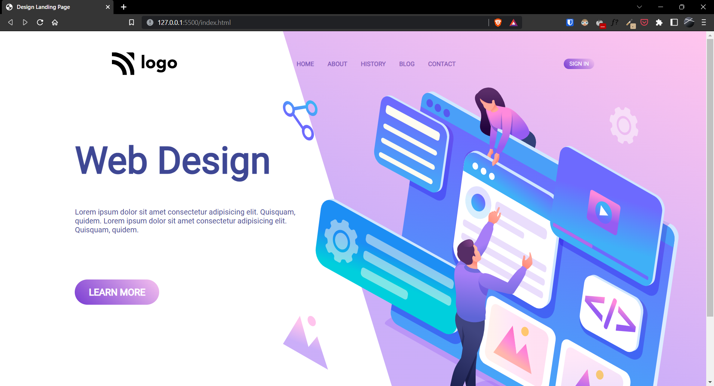

# Project-08 | Design Landing Page

Hi there,
I'm Wasit Ali and this is my 8th project on HTML and CSS.

## 🖥 Preview

🚀 [Live Preview](https://famous-arithmetic-b46a85.netlify.app/)

## 🛠️ What I have learned in this project?

- Color gradient property in css.
- Also learnt about buttons and added click animation using active property.
- Media queries.

## ⏲ Time to finish the project

- Almost 11 hours
